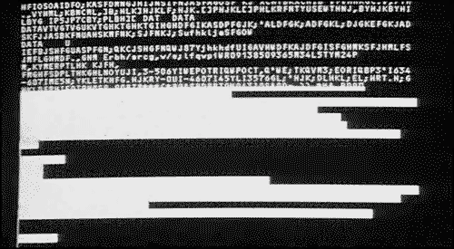

# qrss

## Description
Screensaver with a random generated QR codes and glitches



## To Do
- [ ] Create a Minimum Viable Product (MVP)
- [ ] Add smooth shape support
- [ ] Add CRT TV effects
- [ ] Add glitches

## Usage
```bash
qrss [OPTION]...

-b background color, like a "red", "green", or "#d51143" (default is "black")

-c color of QR codes, same like in background option (default is "white")

-g show glitches sometimes, when screen refreshes (instead of QR codes)

-message show little phrases sometimes in a center of screen in different languages
e.g. english, russian, japanese, hebrew, arabic

-t timeout in seconds between refresh QR codes (default is 1)

-theme write a specific theme, what you want to see in QR codes. For example, "cars"
```

## Example
```bash
qrss -c pink -t 5 -theme cars -g -message
open https://www.google.com/search?udm=2&q=cars
```